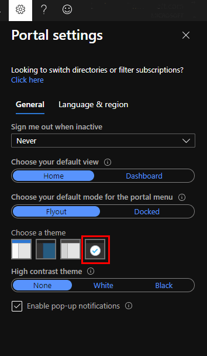
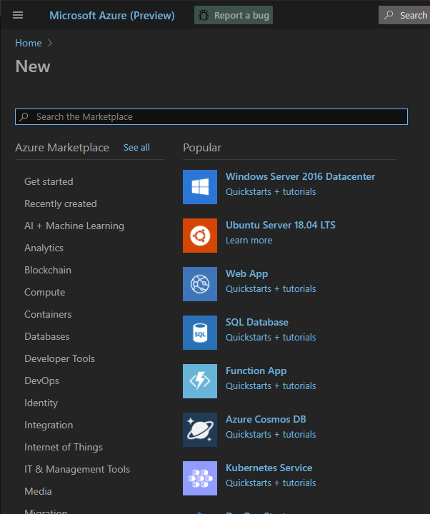

# Theme for Azure Portal

[This extremely light Chrome extension](https://chrome.google.com/webstore/detail/easy-theme-for-azure-port/jnfbljnollcdbbfmenlajfbnjgocifgc?hl=en-GB&authuser=0) modifies colors for the Dark theme used in the Azure Portal.

After installing extension choose Dark theme in the Portal settings and refresh the page.

As a result default Dark theme...

...will look like this one.  Enjoy!

# Contributing

This project welcomes contributions and suggestions.