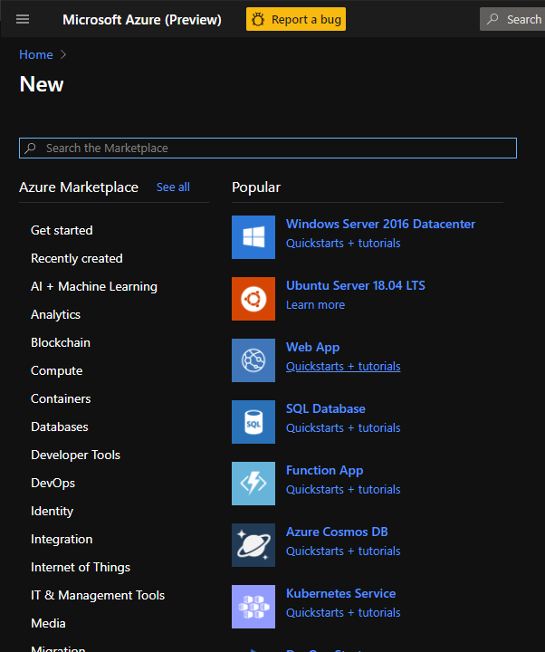

# Theme for Azure Portal


[Theme for Azure Portal](https://chrome.google.com/webstore/detail/easy-theme-for-azure-port/jnfbljnollcdbbfmenlajfbnjgocifgc) is extremely light Chrome extension that modifies colors for the Dark theme used in the Azure Portal.

After installing extension choose Dark theme in the Portal settings and refresh the page.


As a result default Dark theme...



...will look like this one.  


Enjoy!

# How is it working?

When page is loaded.  Extentsion adds new style tag after the `<body />`.  New styles override colors with `!important` rule.

For example:

```css
.fxs-mode-dark .fxs-portal-bg-txt-br  {
	background-color: #242424 !important;
}
```

# Contributing

This project welcomes contributions and suggestions.
